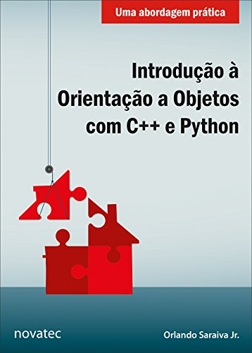

# book-oop

OOP studies from the book "Introdução à Orientação a Objetos com C++ e Python: Uma abordagem prática" by Orlando Saraiva Jr. (Novatec).
Copyright 2017 from Novatec Editora Ltda.

ISBN: 978-85-7522-548-6

The site to buy the book: [Amazon](https://www.amazon.com.br/Introdu%C3%A7%C3%A3o-Orienta%C3%A7%C3%A3o-Objetos-Python-Abordagem/dp/8575225480/ref=sr_1_4?__mk_pt_BR=%C3%85M%C3%85%C5%BD%C3%95%C3%91&crid=2OF4LN0OO8Q99&keywords=orienta%C3%A7%C3%A3o+a+objetos&qid=1640544809&sprefix=orienta%C3%A7%C3%A3o+a+objetos%2Caps%2C152&sr=8-4)

All codes were based on the cited book.

## Contents

1. Um pouco sobre C++
2. Um pouco sobre Python
3. Motivações para orientação a objetos
4. Classes e objetos
5. Construtores, destrrutores e atributos de classe
6. Associações entre classes
7. Herança
8. Herança múltipla
9. Classes abstratas e polimorfismos
- Exercícios
- Referências

## Others

See also the repository [course-python](https://github.com/thiagoneye/course-python).
